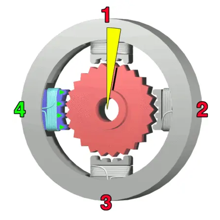

# VPlotter project

This is a raspberry pi + stepper motors driven vplotter, with the simplest setup I could design.
Motors had to be 5V so they can be fed with a USB battery along the cards and pi.

Motors : 28BYJ-48 stepper - 11.5° per full step an x64 gearbox
Driver boards : ULN2003

Code is not specific to any setup and can be parametrized based on your setup.
Be it with other motors, cards, GPIO pins.

Essential concepts are transformation of the rotation of the engines into xy coordinates and Bresenham's algorithm to draw lines somewhat straight between points.

Personal notes - forgetful...
- Low power on the pi will make it look like it's working, but not connect to the network
- ssh pi@raspberrypi.local # if avahi is configured on the pi - it is on mine
- Lost your pi on the network? $sudo arp-scan --localnet # My wifi dongle is Edimax

Next on the list :
Draw a line from a set of manually entered points
Build the toolchain to transform a picture to a line of points understandable by the python code.
